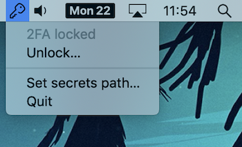
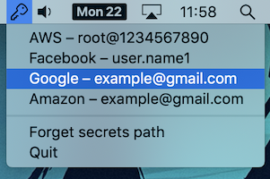
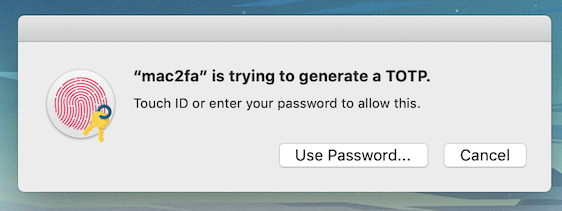

# mac-aegis

Electron app for macOS which can read your [Aegis](https://github.com/beemdevelopment/Aegis) backup file
and produce TOTP codes from the system tray.

  

#### Security warning

The secrets are encrypted at rest in Aegis's file format, and require a password to decrypt
when the app first starts. After that, entry metadata (but not the seeds) are stored in memory,
while the master encryption key is encrypted with an ephemeral in-memory key and stored in the keychain.
All operations involving secrets are done inside of an ephemeral worker thread to avoid secrets being stored in memory,
with one exception being the password loaded on startup (which should be garbage collected shortly).

### Develop

`npm install`

`npm run start` — compiles the TypeScript code and starts an Electron app

### Release

`npm run release` — builds and packages the app into a macOS .app bundle

---

##### Licensed under GPL v3
